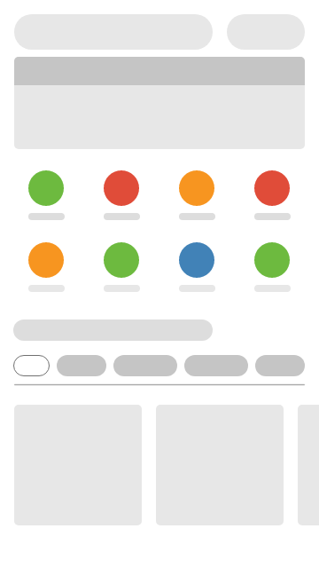

# GridMenu

GridMenu is a simple-but-customizable view consisted list of menu arranged in grid-fashioned way.

[](https://jitpack.io/#bccfilkom/gridmenu)



## Download

### Gradle:
**Step 1.** Add the JitPack repository to your build file
```gradle
allprojects {
	repositories {
		...
		maven { url 'https://jitpack.io' }
	}
}
```

**Step 2.** Add the dependency
```gradle
dependencies {
    implementation 'com.github.bccfilkom:gridmenu:1.0.0'
}
```

### Maven:
**Step 1.** Add the JitPack repository to your build file
```xml
<repositories>
    <repository>
        <id>jitpack.io</id>
        <url>https://jitpack.io</url>
    </repository>
</repositories>
```

**Step 2.** Add the dependency
```xml
<dependency>
    <groupId>com.github.bccfilkom</groupId>
    <artifactId>gridmenu</artifactId>
    <version>1.0.0</version>
</dependency>
```

## Usage

### Add some permission to android manifest:

```xml
<uses-permission android:name="android.permission.INTERNET"/>
<uses-permission android:name="android.permission.READ_EXTERNAL_STORAGE" />
<uses-permission android:name="android.permission.WRITE_EXTERNAL_STORAGE" />
```

Please note that the requirement of the permission is varied to your usage.

- The `INTERNET` permission is required if you need to load the image from internet.
- The `EXTERNAL_STORAGE` permission is required if you need to load the image from device local storage.

### Include following code in your layout:
```xml
<com.bcc.gridmenuview.GridMenu
    android:id="@+id/menu"
    android:layout_width="match_parent"
    android:layout_height="wrap_content"
    app:spanCount="4"/>
```

### Supported URI for Image Providers:

Gridmenu support for multiple URI providers on each menu item's image. Some examples are displayed below, please check it out.

- Drawable: Use this for load image from application resources.
- Network: Use this for load image by URL.
- Local: Use this for load image by file path.

#### Drawable Image Usage:

```java
final ArrayList<MenuItem> list = new ArrayList<>();
list.add(new MenuItem("satu", getResources().getDrawable(R.drawable.ic_launcher_background)));
```

```java
DrawableImageProvider drawableImageProvider = new DrawableImageProvider(getResources().getDrawable(R.drawable.ic_launcher_background));

final ArrayList<MenuItem> list = new ArrayList<>();
list.add(new MenuItem("dua", drawableImageProvider));
```

#### Network Image Usage:

```java
NetworkImageProvider networkImageProvider = new NetworkImageProvider(this, "https://bccfilkom.gridmenu.org/test.jpg");

final ArrayList<MenuItem> list = new ArrayList<>();
list.add(new MenuItem("tiga", networkImageProvider));
```

#### Local Image Usage:

```java
LocalImageProvider localImageProvider = new LocalImageProvider(this, "/storage/emulated/0/DCIM/Camera/gridmenu.jpg");

final ArrayList<MenuItem> list = new ArrayList<>();
list.add(new MenuItem("empat", localImageProvider));
```

### Include following code in your activity:

```java
final ArrayList<MenuItem> list = new ArrayList<>();
list.add(new MenuItem("satu", drawableImageProvider));
list.add(new MenuItem("dua", networkImageProvider));
list.add(new MenuItem("tiga", localImageProvider));

GridMenu menu = findViewById(R.id.menu);
menu.setMenuItems(list);
```

### Add menu item event:

Menu's event for each menu item example

```java
GridMenu menu = findViewById(R.id.square_menu);
menu.setOnClickListener(new OnItemClickListener() {
    @Override
    public void onClick(int position) {
        // do something
    }
});
```

## Supported XML Attributes

| Attribute  | Description                   | Value                | Default Value |
| -----------|-------------------------------|----------------------|---------------|
| spanCount  | Number of columns in GridMenu.| integer              | 3             |
| shapeItem  | The shape of each item        | `circle` or `square` | `circle`      |

## Contributing to this project

Interested in contributing? please check out [the Contributing Guide](CONTRIBUTING.md) to get started
